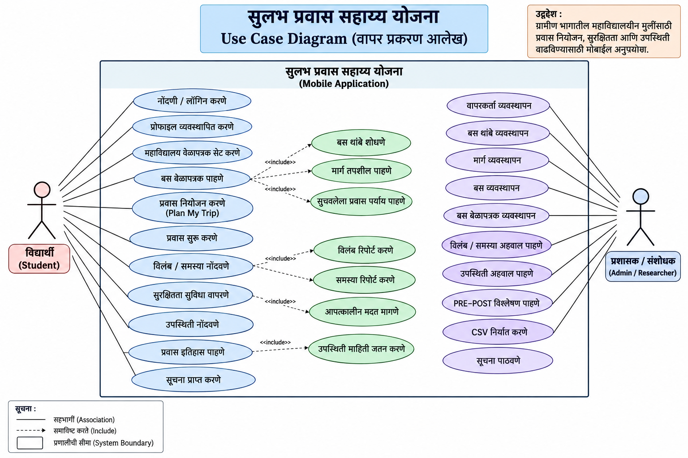
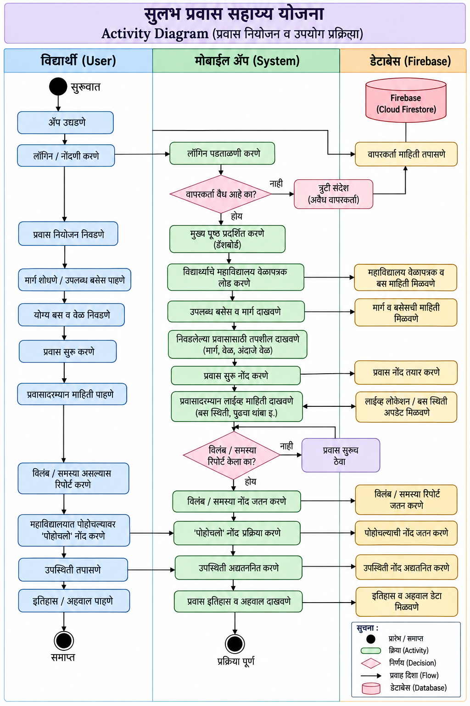
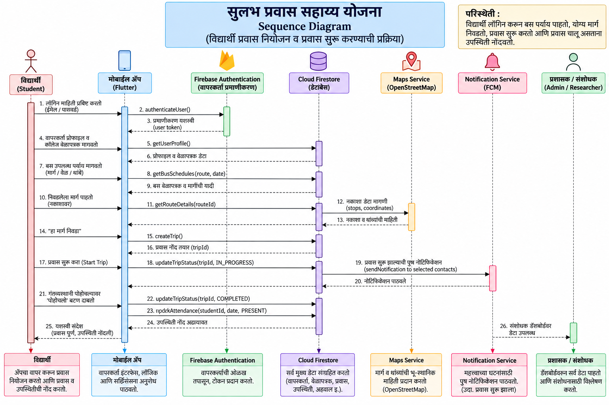
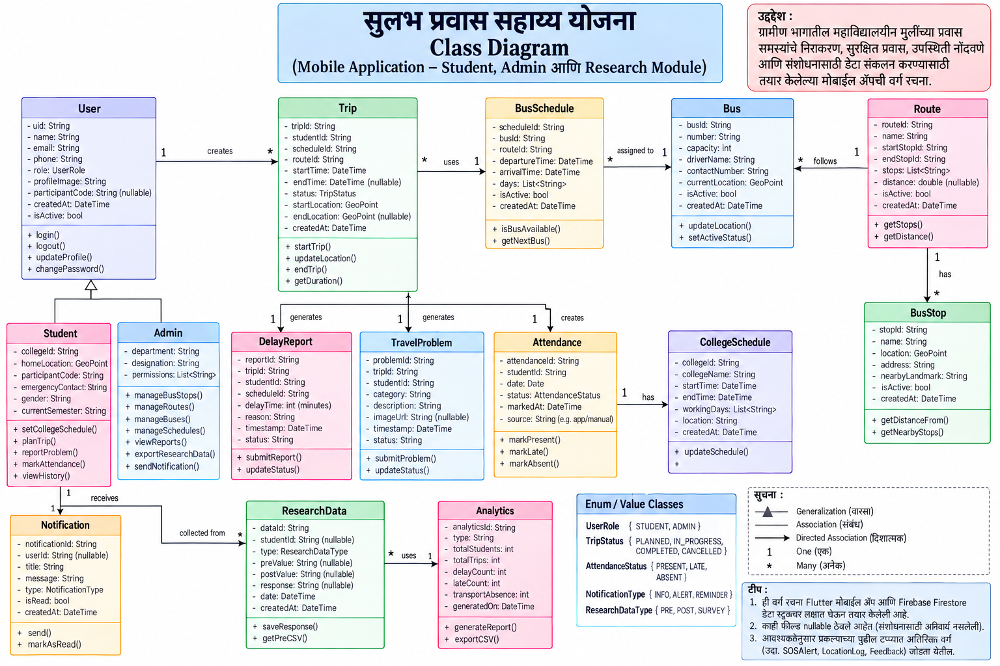
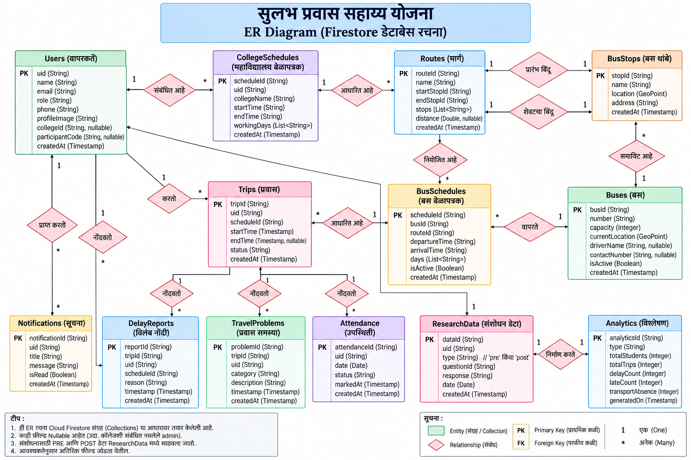

\# सुलभ प्रवास सहाय्य योजना

\## Sulabh Pravas Sahayya Yojana


\*\*A Digital Travel Assistance and Research Application for Rural College-Going Female Students\*\*


सुलभ प्रवास सहाय्य योजना is a Flutter-based mobile application developed to study and support the daily public-transport experiences of rural college-going female students.


The project combines \*\*mobile application development, travel assistance, attendance-related data collection, safety support, and academic research\*\* in a single digital system.


\---


\## 📌 Project Overview


Students travelling from rural areas to colleges often depend on public bus transportation. Their daily travel may be affected by limited bus availability, uncertain schedules, long waiting times, distance from bus stops, delays, missed buses, route-related difficulties and safety concerns.


These travel difficulties may also affect punctuality and college attendance.


The project was therefore developed as a digital intervention to:


\- understand the travel problems experienced by rural college-going female students;

\- provide useful travel-related information and planning support;

\- allow students to record travel delays and problems;

\- support safety-related functions;

\- maintain travel and attendance-related records; and

\- provide structured data for research analysis.


\---


\## 🎯 Research Objectives


The major objectives of the project are:


1\. To identify the bus and travel-related problems experienced by rural college-going female students.

2\. To study difficulties related to bus timing, waiting time, route information, bus-stop accessibility, delays and safety.

3\. To develop a digital travel assistance system based on the identified problems.

4\. To provide students with facilities for journey planning, bus schedule information and nearby bus-stop identification.

5\. To provide facilities for reporting bus delays and travel-related problems.

6\. To study the usability and perceived usefulness of the developed application.

7\. To maintain structured travel and attendance-related records for research purposes.

8\. In a longer-term evaluation, to examine changes in attendance, late arrivals and transport-related absences.


\---


\## 🔬 Research Methodology


The project follows an \*\*Applied Mixed-Method Research Approach\*\*.


The current research process includes:


\*\*Problem Identification → Pre-Use Survey → Travel Problem Analysis → Digital Intervention → Beta Testing → During-Use Feedback → Post-Use Feedback → Usability \& Perceived Usefulness Analysis\*\*


A longer-term \*\*One-Group Pre-Test–Post-Test\*\* evaluation is proposed for studying measurable changes in attendance, late arrivals and transport-related absences.


\### Research Stages


\*\*1. Pre-Use Stage\*\*


A descriptive survey is used to understand existing travel difficulties and collect baseline information.


\*\*2. Digital Intervention\*\*


The Sulabh Pravas Sahayya Yojana mobile application is introduced to participating students.


\*\*3. Beta-Use Evaluation\*\*


Students use the application and provide feedback about usability, features, technical difficulties and usefulness.


\*\*4. Post-Use Evaluation\*\*


Students provide feedback regarding their experience and perceived usefulness of the application.


\*\*5. Long-Term Evaluation\*\*


A longer observation period is proposed for comparing objective PRE and POST travel/attendance indicators.


> \*\*Research Note:\*\* Short-term beta-use feedback represents usability and perceived usefulness. It should not be interpreted as proof that the application has already improved attendance or reduced late arrivals.


\---

## 📊 System Diagrams

The following diagrams represent the design, workflow, data relationships and interaction structure of the **Sulabh Pravas Sahayya Yojana** application.

### 1. Use Case Diagram

The Use Case Diagram represents the major interactions between students, administrators and the application.



### 2. Activity Diagram

The Activity Diagram illustrates the major workflow of the application, including student travel planning and journey-related activities.



### 3. Sequence Diagram

The Sequence Diagram represents the interaction between the user, Flutter application and backend services during important application processes.



### 4. Class Diagram

The Class Diagram represents the major application entities/classes and their relationships.



### 5. ER Diagram

The Entity-Relationship Diagram represents the major data entities and relationships used for application and research data management.



On Sat, 3 Oct 2026 at 08:39, Abhishek Vaidya <abhishekvaidya2702@gmail.com> wrote:


\## 👩‍🎓 Target Participants


The research is designed primarily for rural college-going female students who depend on bus/public transportation for travelling to and from college.


The pilot/beta study uses approximately \*\*30 participants\*\*.


Participant codes such as `SP001`, `SP002`, etc. can be used for research records instead of publishing student identities.


\---


\## 📱 Student Application Features


The student-side application includes:


\- Student Registration and Login

\- Student Profile

\- College Schedule Setup

\- Bus Schedule

\- Bus Details

\- Plan My Trip

\- Recommended Journey

\- Active Journey

\- Nearby Bus Stops

\- OpenStreetMap Integration

\- GPS/Location Support

\- Report Bus Delay

\- Report Travel Problem

\- Reached College

\- Attendance Records

\- Travel History

\- Safety/SOS Support

\- Location Sharing

\- Notifications


\---


\## 🚌 Plan My Trip


The journey-planning module assists students in selecting a suitable journey based on available route and schedule information.


Typical workflow:


`Select Route → Enter Required College Arrival Time → Find Journey → View Recommended Journey → Start Trip → Report Delay/Problem if Required → Reached College`


\---


\## 🗺️ Nearby Bus Stops


Nearby Bus Stops uses:


\- GPS/location services

\- OpenStreetMap

\- Flutter Map

\- stored bus-stop coordinates


The module helps students identify nearby bus stops and estimate their distance.


\---


\## 🛡️ Safety Support


The application includes safety-oriented functionality such as:


\- Safety/SOS access

\- Current location support

\- Location sharing


These features are intended to provide additional travel assistance to students.


\---


\## 🧑‍💼 Admin Dashboard


The administrative/research dashboard provides facilities for managing transportation information and reviewing research-related records.


\### Transport Management


Admin can manage:


\- Bus Stops

\- Routes

\- Buses

\- Bus Schedules


\### Research Monitoring


The dashboard can provide information about:


\- Registered students

\- Delay reports

\- Travel problems

\- Late arrivals

\- Transport-related absences

\- Attendance records

\- PRE/POST research indicators

\- Travel-problem summaries


\---


\## 📊 Research Data


Research-related indicators may include:


\### Travel Variables


\- Bus availability

\- Bus delays

\- Waiting time

\- Route information

\- Distance/access to bus stops

\- Missed buses

\- Travel problems

\- Safety-related concerns


\### Attendance/Travel Outcomes


\- Recorded college days

\- Attended days

\- Attendance percentage

\- Late arrivals

\- Transport-related absences


\### App Evaluation


\- Usability

\- Feature usefulness

\- Perceived usefulness

\- Satisfaction

\- Technical difficulties

\- Open-ended student feedback


\---


\## 📄 Research Instruments


The project documentation includes research instruments such as:


\- Pre-Use Survey Questionnaire

\- Beta-Use / During-Use Feedback Questionnaire

\- Post-Use Questionnaire

\- Open-ended feedback questions


These instruments are intended to support systematic collection of student travel experiences and application feedback.


\---


\## 🔐 Privacy and Research Ethics


Participant privacy is an important part of this project.


Public versions of this repository should not contain:


\- Student names

\- Phone numbers

\- Personal email addresses

\- Firebase user IDs

\- Exact private/home locations

\- Identifiable consent records

\- Private participant responses

\- Authentication credentials


Research datasets intended for public use should be properly anonymized before publication.


\---


\## 💻 Technology Stack


| Technology | Purpose |

|---|---|

| Flutter | Cross-platform mobile application development |

| Dart | Application programming language |

| Firebase Authentication | User authentication |

| Cloud Firestore | Cloud database |

| Firebase Cloud Messaging | Notification support |

| OpenStreetMap | Map data |

| flutter\_map | Map integration |

| GPS / Location Services | Location-based functionality |

| Firestore Security Rules | Database access control |

| CSV Export | Research data export |


\---

## 🔥 Firebase Configuration

This repository does not include project-specific Firebase configuration files for security and deployment separation.

The following files are intentionally excluded:

- `android/app/google-services.json`
- `lib/firebase_options.dart`

To run the project with your own Firebase backend:

1. Create a Firebase project.
2. Enable Firebase Authentication.
3. Enable Email/Password authentication.
4. Create a Cloud Firestore database.
5. Register the Flutter/Android application with Firebase.
6. Configure the project using FlutterFire CLI.
7. Add the generated Firebase configuration files locally.
8. Configure appropriate Firestore Security Rules before deployment.

The Firebase backend should contain the collections required by the application, such as users, routes, buses, bus schedules, bus stops, journeys, attendance records, delay reports and travel-problem records.

> Do not commit private service-account credentials, signing keys, passwords or participant-identifiable research data to this repository.

\## 🏗️ System Architecture


The application broadly follows:


`Student/Admin → Flutter Mobile Application → Firebase Authentication → Cloud Firestore → Travel/Attendance/Research Data`


Location-related modules use device location services and OpenStreetMap.


\---


\## 📂 Repository Structure


```text

sulabh-pravas-sahayya-yojana/

├── lib/

├── android/

├── assets/

├── test/

├── docs/

│   ├── project-overview/

│   ├── research/

│   ├── diagrams/

│   └── screenshots/

├── pubspec.yaml

├── pubspec.lock

└── README.md

